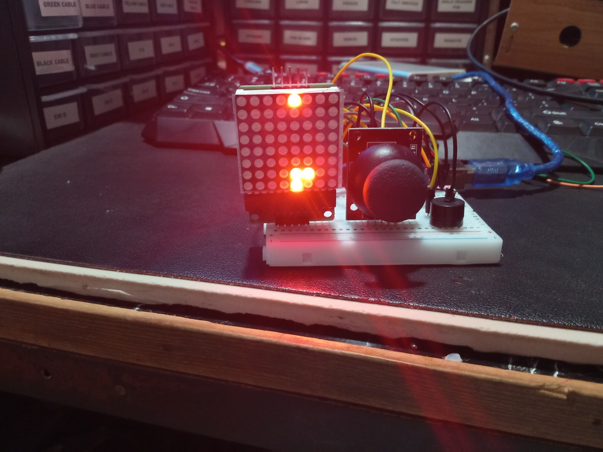
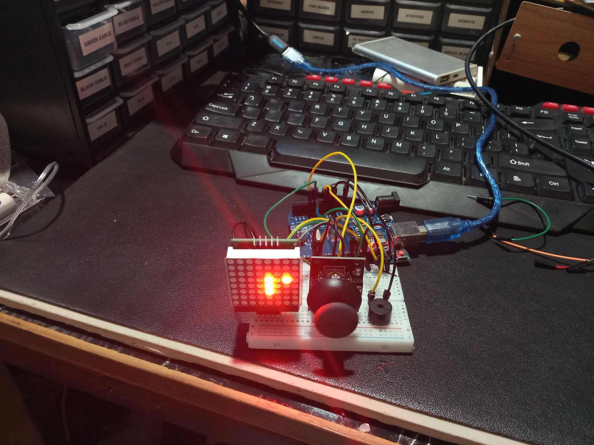
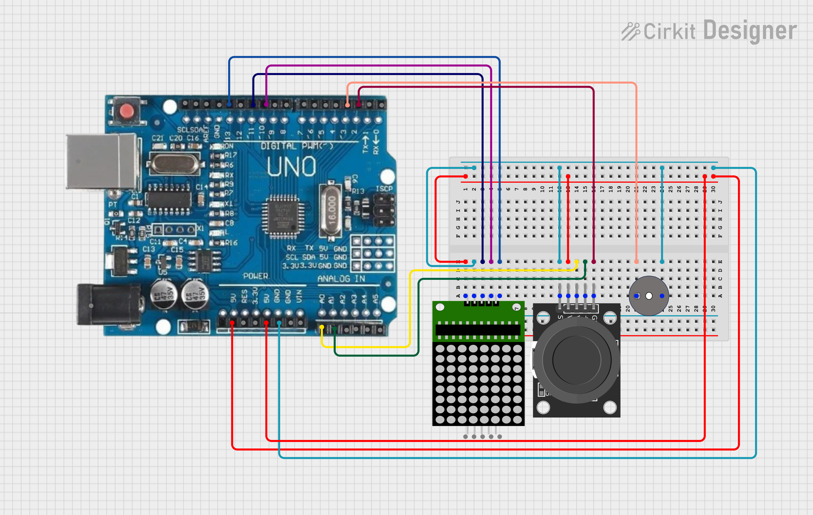

---

# Snake Game Dot Matrix 🎮🐍

A retro **Snake Game** built with an **Arduino Uno**, **MAX7219 Dot Matrix Display**, **Joystick Module**, and **Passive Buzzer** for sound effects and background music. This project brings classic arcade fun into the embedded world.

 
 

---

## ✨ Features

* Snake moves with joystick controls (Up, Down, Left, Right)
* Food spawns randomly on the matrix
* Snake grows when eating food
* Collision detection (self-hit = game over)
* Event sounds: eat, game over, startup melody
* Background music that loops during gameplay
* Wrap-around map edges

---

## 🛠️ Technologies Used

* **Arduino Uno R3** (ATmega328P)
* **MAX7219 Dot Matrix (8x8)**
* **Joystick Module (X, Y, SW)**
* **Passive Buzzer**
* **Libraries**:

  * [MD_MAX72XX](https://github.com/MajicDesigns/MD_MAX72XX) for display control
  * Arduino built-in `tone()` function for sound

---

## 🚀 Getting Started

### Prerequisites

* Arduino IDE installed
* Install `MD_MAX72XX` library via **Library Manager**

### Hardware Setup

* Connect **MAX7219** → `DIN=11`, `CS=10`, `CLK=13`
* Connect **Joystick** → `X=A0`, `Y=A1`, `SW=2`
* Connect **Buzzer** → `Pin 3`
* Power from Arduino USB

### Installation

1. Clone this repo:

   ```bash
   git clone https://github.com/yourusername/snake-game-dot-matrix.git
   cd snake-game-dot-matrix
   ```
2. Open the `.ino` file in Arduino IDE
3. Select board **Arduino Uno**
4. Upload to your board

---

## 🎮 Usage

* Move joystick to control snake direction
* Eat food to grow longer
* Avoid hitting yourself
* Game resets on collision
* Sounds indicate **start, eat, and game over events**

---

## 📂 Project Structure

```
Snake-Game-Dot-Matrix/
│── snake_game_dot_matrix.ino   # Main Arduino sketch
│── README.md                   # Project documentation
│── LICENSE                     # License file
│── assets/                     # (Optional) Images, diagrams
```

---

## 📦 Packaging for Distribution

* Zip the whole project folder
* Include `snake_game_dot_matrix.ino`, `README.md`, and `LICENSE`
* Share via GitHub release or email

---

## 🔮 Future Enhancements

* Add score display (using additional matrix or serial monitor)
* Speed increase as snake grows
* Multiple food types (bonus food, poison food)
* Support for larger displays (4x MAX7219 chained)
* Save high scores to EEPROM

---

## 📝 Changelog

### v1.0.0

* Initial release
* Snake movement, food spawning, wrap-around map
* Eat sound, game-over sound, startup melody
* Background music loop during gameplay

---

## 💻 System Requirements

* Arduino Uno or compatible
* 5V power supply / USB power
* Arduino IDE 1.8+ or Arduino IDE 2.x

---

## ⚠️ Troubleshooting

* **Snake not moving** → Check joystick wiring (X=A0, Y=A1, SW=2)
* **No sound** → Verify buzzer on Pin 3, ensure it’s **passive**, not active
* **Display blank** → Check MAX7219 connections (DIN=11, CS=10, CLK=13) and external power if chaining more modules

---

## 🙏 Acknowledgements

* [MajicDesigns/MD_MAX72XX](https://github.com/MajicDesigns/MD_MAX72XX) library
* Classic Snake game inspiration
* Arduino community
* app.cirkitdesigner.com
* Nooby 
* Firelink
* SBBC PC
* Rita's PC
* To my dog and cat

---

## 📜 License

This project is licensed under the MIT License – see the [LICENSE](LICENSE) file for details.

---
